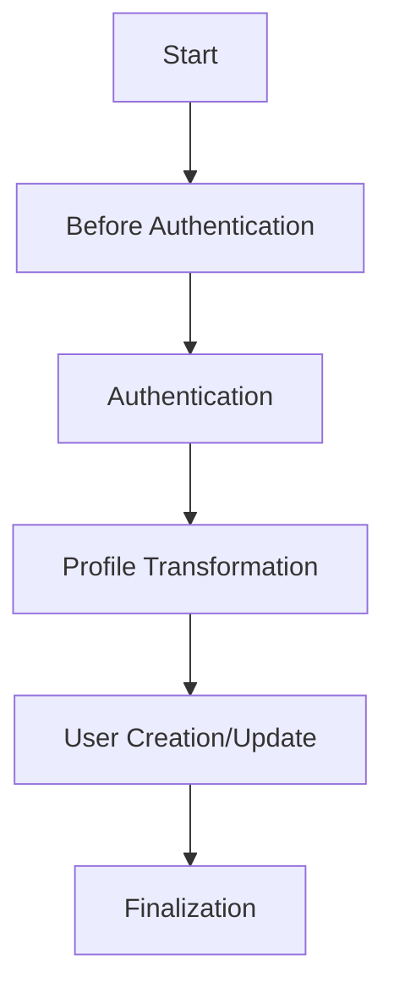

# Authentication Workflows

This directory contains the workflow implementations for the Medusa Authentication Plugin v2.

## Overview

The authentication workflow is built using Medusa's workflow system, providing a modular and extensible approach to handling authentication flows. The workflow is composed of several steps that can be customized or extended based on your needs.

## Workflow Architecture



### Workflow Steps

1. **Before Authentication**
   - Validates input parameters
   - Prepares authentication context
   - Initializes provider strategy

2. **Authentication**
   - Executes provider-specific authentication
   - Handles OAuth flow
   - Returns authentication result

3. **Profile Transformation**
   - Transforms provider profile to standardized format
   - Normalizes user data
   - Handles custom field mapping

4. **User Creation/Update**
   - Creates new user if not exists
   - Updates existing user information
   - Handles user metadata

5. **Finalization**
   - Emits authentication events
   - Returns final authentication result
   - Handles session creation

## Usage

```typescript
import { AuthWorkflow } from "../auth"
import { AuthWorkflowState } from "./types"

// Initialize workflow
const workflow = new AuthWorkflow()

// Execute workflow
const result = await workflow.execute({
  provider: "google",
  container: container,
  // ... other options
})
```

## Customization

### Custom Step

```typescript
import { createStep } from "@medusajs/workflows-sdk"
import { AuthWorkflowState } from "./types"

export const customAuthStep = createStep<AuthWorkflowState>(
  "custom-auth",
  async (input) => {
    // Custom authentication logic
    return {
      // ... step result
    }
  }
)
```

### Custom Workflow

```typescript
import { createWorkflow } from "@medusajs/workflows-sdk"
import { AuthWorkflowState } from "./types"

export const CustomAuthWorkflow = createWorkflow<AuthWorkflowState>(
  "custom-auth-flow",
  (input) => {
    // Custom workflow implementation
    return {
      // ... workflow result
    }
  }
)
```

## Error Handling

The workflow includes comprehensive error handling:

```typescript
try {
  const result = await workflow.execute(options)
  // Handle success
} catch (error) {
  if (error instanceof AuthenticationError) {
    // Handle authentication error
  } else if (error instanceof WorkflowError) {
    // Handle workflow error
  }
  // Handle other errors
}
```

## Events

The workflow emits the following events:

- `auth.before_authenticate`
- `auth.authenticated`
- `auth.error`
- `auth.user_created`
- `auth.user_updated`

## Type Definitions

See [types.ts](./types.ts) for complete type definitions used in the workflow.
